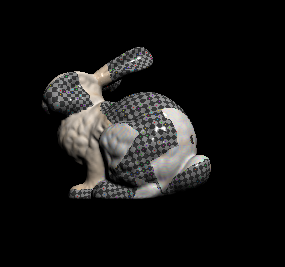

## mi05 – Rasterizace na CPU
Vytvořte softwarový rasterizér. Vyberte rozumnou funkcionalitu, kterou implementujete.
Navrhněte vhodné API pro použití rasterizéru k vykreslování scén.
Demonstrujte jeho funkčnost na vhodné scéně (trojúhelníkové modely, textury, osvětlení, ...).
Důraz bude kladen na jednoduchost a přehlednost zdrojového kódu, na efektivitu implementace, na pochopení problematiky a zaměření na kritická místa rasterizace.

## Example result

